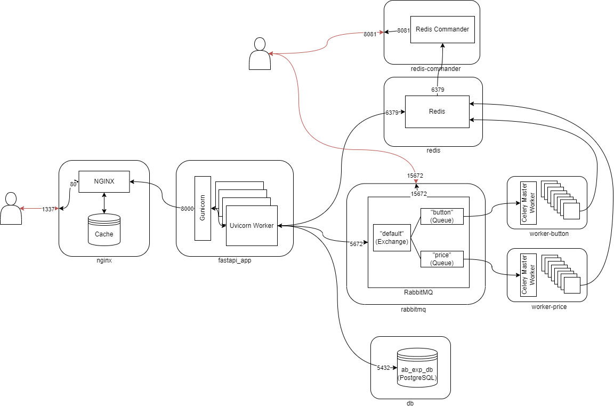

# A/B Experiments Backend


Проект реализует простое REST API для проведения A/B тестов мобильных приложений. Он состоит из одного эндпоинта, который предоставляет информацию об экспериментах мобильным клиентам.

### Функциональные требования

Подробное описание представлено в [Техническом Задании](https://github.com/semyonnakrokhin/ab_experiments_backend/blob/main/%D0%A2%D0%97.docx)
1. Получение списка экспериментов: Мобильное приложение может получить список экспериментов с их значениями, отправив GET запрос на /api/v1/experiments. При запросе требуется предоставить уникальный идентификатор устройства в заголовке Device-Token. Ответом на запрос будет JSON объект, содержащий список экспериментов и их значений в формате [{"experiment_name": "option"}, ...].
2. Статистика экспериментов: Для просмотра статистики по экспериментам пользователь может отправить GET запрос на /pages/experiment-stats. На выходе будет HTML страница с таблицей, отображающей информацию о каждом эксперименте, общее количество устройств, участвующих в эксперименте, и их распределение между опциями.

### Ограничения:

1. Каждый устройство должно попадать только в одну группу эксперимента и оставаться в ней.
2. Если устройство однажды получило значение, оно должно оставаться с этим значением.
3. Эксперименты проводятся только для новых устройств, то есть если эксперимент создан после первого запроса от устройства, оно не должно получать информацию об этом эксперименте.


# Запуск в контейнерах Docker



При запуске в контейнерах поднимается веб-сервер NGINX, который сконфигурирован с возможностью кеширования данных.
Пользователь отправляет запрос с дополнительным заголовком Device-Token. Если пользователь уже отправлял запрос с таким заголовком, то, если в кэше еще осталась информация об этом запросе именно с этим заголовком, то nginx возвращает ответ, который лежит в кэше.
Если в пользователь не отправлял запрос с таким заголовком или если отправлял, но в кэше нет информации об этом запросе, то запрос проксируется на сервер приложения.

Время хранения ответа от "api/v1/experiments" составляет 5 минут
Время хранени ответа от "pages/experiment-stats" составляет 1 минуту

Каждый экспперимент обрабатывается параллельно, в фоне, своим Celery воркером. В качестве брокера используется RabbitMQ, в качестве Results Backend - Redis

Чтобы запустить проект:

1. Перейдите в директорию с вашими проектами.
2. Склонируйте репозиторий на свой локальный компьютер:


```shell
# Linux
> https://github.com/semyonnakrokhin/ab_experiments_backend.git
```

3. Перейдите в каталог проекта:

```shell
# Linux
> cd ab_experiments_backend
```

4. В этой директории и в директории ./fastapi_app создайте файлы, перечисленные в [environment.txt](https://github.com/semyonnakrokhin/ab_experiments_backend/blob/main/environment.txt). В какой именно директории нужно создавать файл указано в квадратных скобках

5. Выполните команду находясь в корневой директории проекта:

```shell
# Linux
> docker-compose up --build
```

6. Откройте веб-браузер и перейдите по адресу http://localhost:1337/docs для доступа к веб-сервису в режиме Swgger.
Для отслеживания информации в базе данных Redis, вы также можете использовать Redis Commander, который доступен на порту 8081. Просто откройте браузер и перейдите по адресу http://localhost:8081.

7. Для остановки контейнеров выполните команду:

```shell
# Linux
> docker-compose down
```

# Тестирование в контейнерах Docker

1. Убедитесь, что в корневой директории есть все файлы, перечисленные в [environment.txt](https://github.com/semyonnakrokhin/ab_experiments_backend/blob/main/environment.txt)

2. Выполните команду находясь в корневой директории проекта:

```shell
# Linux
> docker-compose -f docker-compose_test.yaml up --build
```

3. Для остановки контейнеров выполните команду:

```shell
# Linux
> docker-compose down
```

# Авторы
Семен Накрохин
2206095@gmail.com

# Лицензия
Этот проект распространяется под лицензией MIT. Подробности смотрите в файле LICENSE.
